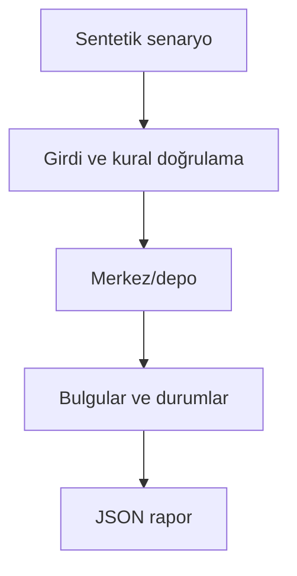

# Mimari

Mağaza replenishment taleplerini sınırlı merkez kapasitesi ve yoldaki stokla birlikte değerlendirmek.

Asıl alan akışı: **Supply arrival → store demand → inventory position → unit round robin → pipeline**. CLI JSON yükler, çekirdek `run(config)` alan motorunu çağırır ve JSON seri hale getirir. Veritabanı kullanan örnekler geçici dizinde izole edilir; kalıcı sınıflar doğrudan çağrılırken dosya yolu dışarıdan verilir.

## İnvariant ve başarısızlık sınırı

Günlük deterministik zaman adımı ve seeded sentetik talep; satış kaybı backorder olmaz.

Talep korelasyonu, kapasite kesintileri ve optimizasyon dışarıdan eklenmelidir.

Her hata kararı makine tarafından okunabilir çıktı veya açık exception üretir. Geçersiz yapılandırma sessizce düzeltilmez. Olası tekrarların güvenliği ilgili çekirdeğin kabul kurallarına bağlıdır; bütün projelere ortak bir retry uygulanmaz.
